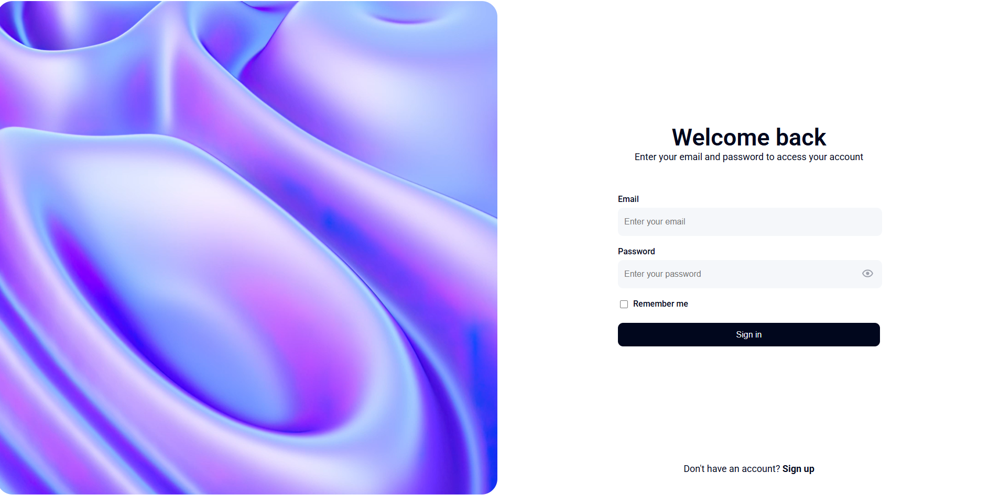
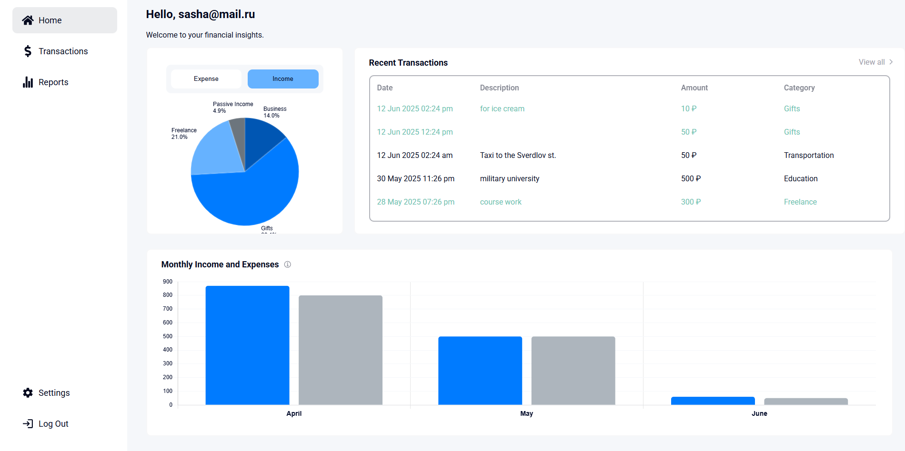
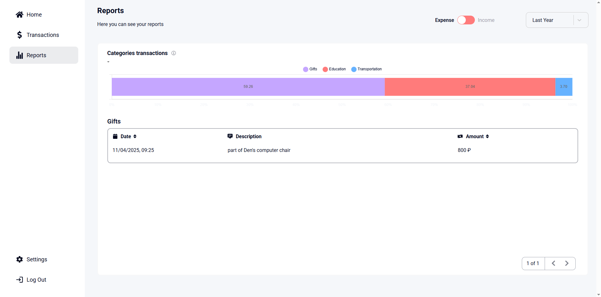
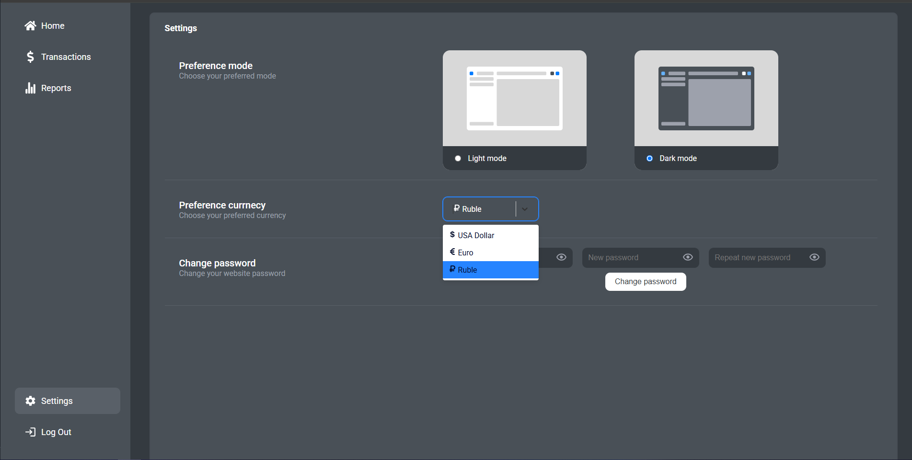

# BudgetTracker

**BudgetTracker** — это современное веб-приложение для учета личных финансов, построенное на стеке React + Redux Toolkit + Prisma + Express.  
Проект позволяет удобно отслеживать доходы и расходы, анализировать статистику по категориям, строить графики и управлять своими транзакциями.

---

## 🚀 Функционал

- Регистрация и авторизация пользователей
- Добавление, редактирование и удаление транзакций
- Категоризация доходов и расходов
- Просмотр истории операций с фильтрацией и сортировкой
- Графики и диаграммы по категориям и периодам (Chart.js)
- Адаптивный дизайн для разных устройств
- Удобная навигация и быстрый поиск
- Валидация форм и уведомления об ошибках

---

## 🛠️ Основные зависимости

### Frontend (`client`):

- **React** — библиотека для построения интерфейсов
- **Redux Toolkit** — управление состоянием приложения
- **React Router DOM** — маршрутизация
- **@table-library/react-table-library** — таблицы с сортировкой и выбором
- **Chart.js + react-chartjs-2** — визуализация данных
- **React Hook Form** — работа с формами
- **React Icons** — иконки
- **Sass** — стилизация
- **Zod** — валидация данных

### Backend (`server`):

- **Express** — серверное приложение
- **Prisma** — ORM для работы с базой данных (MySQL)
- **jsonwebtoken** — аутентификация
- **bcryptjs** — хеширование паролей

---

## 📦 Установка и запуск

1. **Клонируйте репозиторий:**
   ```bash
   git clone https://github.com/your-username/budget-tracket.git
   cd budget-tracket
  ```

2. **Установите зависимости для клиента и сервера:**
   ```bash
    cd client
    npm install
    cd ../server
    npm install
  ```

3. **Настройте переменные окружения для сервера:**
   ```bash
    DATABASE_URL= __secret__
    SECRET_KEY= __secret__
    PORT = __secret__
  ```

4. **Запустите сервер:**
   ```bash
    cd server
    npm start
  ```

5. **Запустите клиент:**
   ```bash
    cd client
    npm start
  ```

## 🖼️ Скриншоты и видео






